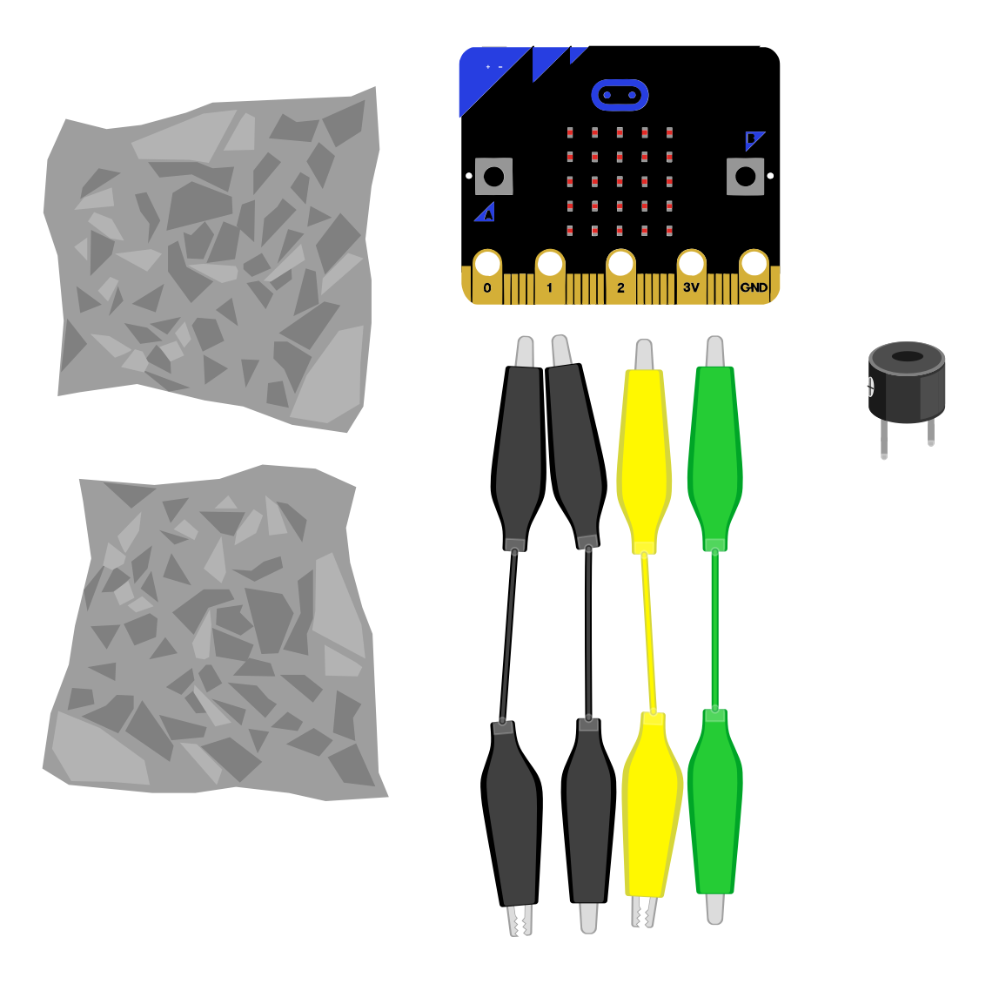

## What you will make

Make a sock puppet that makes cute sounds! Here is a video of the puppet in action.

**🔊 Sound on!** 
<html>

<iframe style="position: absolute; top: 0; left: 0; right: 0; width: 100%; height: 100%; border: none;" src="https://www.youtube.com/embed/yueLSOEp7N4?rel=0&cc_load_policy=1" allowfullscreen allow="accelerometer; autoplay; clipboard-write; encrypted-media; gyroscope; picture-in-picture; web-share">
</iframe>

 
</html>

### You will need:

**For the puppet**
- a sock, that fits your hand
- thin card
- corragated card
- a paper cup
- yarn or fabric for hair
- hairband or elastic band
- googly eyes (optional - but highly recommended!)
- scissors
- glue or tape

**For the circuit**
- Microbit and USB cable
- the [starter project](https://rpf.io/sock-puppet){:target="_blank"}
- crocodile clips
- alumninum foil
- active buzzer (optional if using a Microbit V2)

{:width="500px"}