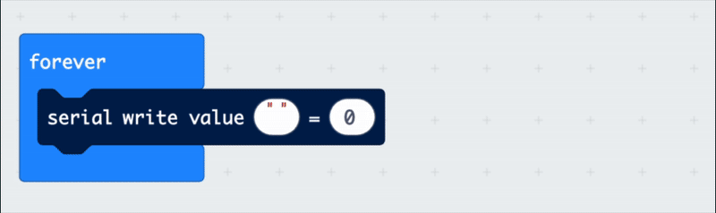

## Change sounds on rotate 

<div style="display: flex; flex-wrap: wrap">
<div style="flex-basis: 200px; flex-grow: 1; margin-right: 15px;">
Make a foil switch and add to micro:bit 
</div>
<div>

{:width="300px"}

</div>
</div>

<html>
<div style="position: relative; width: 100%; aspect-ratio: 16 / 9; border-radius: 20px; box-shadow: 0 0 15px #3fb654; overflow: hidden;">
<iframe style="position: absolute; top: 0; left: 0; right: 0; width: 100%; height: 100%; border: none;" src="https://www.youtube.com/embed/t5UzLuTj_CE?rel=0&cc_load_policy=1" allowfullscreen allow="accelerometer; autoplay; clipboard-write; encrypted-media; gyroscope; picture-in-picture; web-share">
</iframe>
</div><br>
</html>
<div style="text-align: center; margin-top: 1em;">

Play, pause, make. Follow the project on our [YouTube](10) playlist!
</div>

--- task ---
### View serial data

Add a new `forever` block.

Under `Advanced`, drag a `serial write` block.

```microbit
basic.forever(function () {
    serial.writeValue("x", 0)
})
```
--- /task ---

--- task ---
From the `input - more` menu drag `rotation` into the second field. 

In the first field type 'rotation'.


--- /task ---


--- task ---
Click on **Show data Device**, you might need to scroll to see it.

 
--- /task ---


--- task ---
Look at how the rotation data changes when you move the puppet.


--- /task ---


--- task ---
Record the rotation number for when the puppet is down (in this case it is -38).


--- /task ---
