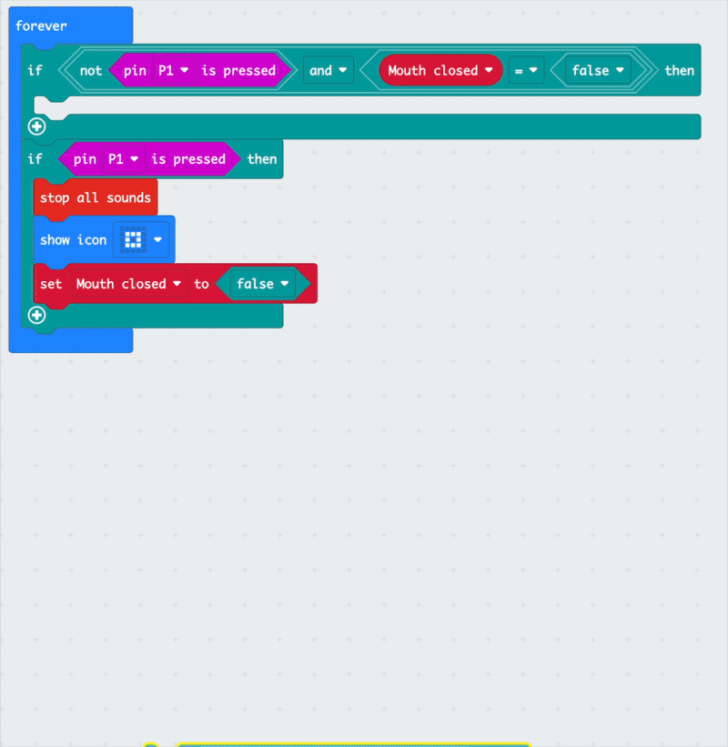

## Add sad sound 
<div style="display: flex; flex-wrap: wrap">
<div style="flex-basis: 200px; flex-grow: 1; margin-right: 15px;">
Make a foil switch and add to micro:bit 
</div>
<div>

{:width="300px"}

</div>
</div>

<html>
<div style="position: relative; width: 100%; aspect-ratio: 16 / 9; border-radius: 20px; box-shadow: 0 0 15px #3fb654; overflow: hidden;">
<iframe style="position: absolute; top: 0; left: 0; right: 0; width: 100%; height: 100%; border: none;" src="https://www.youtube.com/embed/t5UzLuTj_CE?rel=0&cc_load_policy=1" allowfullscreen allow="accelerometer; autoplay; clipboard-write; encrypted-media; gyroscope; picture-in-picture; web-share">
</iframe>
</div><br>
</html>
<div style="text-align: center; margin-top: 1em;">

Play, pause, make. Follow the project on our [YouTube](10) playlist!
</div>


--- task ---
### Use the rotaion data

Make a new `forever`{:class='microbitbasic'} block, and add a `if else`{:class='microbitlogic'}.

Drag a `less than`{:class='microbitlogic'} block from the `logic`{:class='microbitlogic'} menu. Drag in `rotation`{:class='microbitinput'} and type the number you recorded in the last step.


--- /task ---


--- task ---
Add the `play tone`{:class='microbitmusic'} `show icon`{:class='microbitbasic'}, and `set Mouth closed`{:class='microbitvariables'} blocks into `if then`{:class='microbitlogic'}.

If the rotation is less than -38, then happy sounds will play.

```microbit
basic.forever(function () {
    if (input.rotation(Rotation.Pitch) < -38) {
        music.play(music.tonePlayable(880, music.beat(BeatFraction.Half)), music.PlaybackMode.UntilDone)
        music.play(music.tonePlayable(988, music.beat(BeatFraction.Quarter)), music.PlaybackMode.UntilDone)
        basic.showIcon(IconNames.Square)
        Mouth_open = true
    } else {
    	
    }
})
```
--- /task ---


--- task ---
### Add sad sounds

Add two new `play tone`{:class='microbitmusic'} blocks to the `else`{:class='microbitlogic'}. 

These will be your sad sounds so make them lower notes, and longer.  

```microbit
        if (input.rotation(Rotation.Pitch) < -38) {
            music.play(music.tonePlayable(880, music.beat(BeatFraction.Half)), music.PlaybackMode.UntilDone)
            music.play(music.tonePlayable(988, music.beat(BeatFraction.Quarter)), music.PlaybackMode.UntilDone)
            basic.showIcon(IconNames.Square)
            Mouth_open = true
        } else {
            music.play(music.tonePlayable(196, music.beat(BeatFraction.Whole)), music.PlaybackMode.UntilDone)
            music.play(music.tonePlayable(165, music.beat(BeatFraction.Whole)), music.PlaybackMode.UntilDone)
            Mouth_open = true
        }
```
--- /task ---


--- task ---
**Test:** check the sad and happy sounds are working when you rotate the puppet.
--- /task ---


--- task ---
### Move blocks back

Move the new `if else`{:class='microbitlogic'} back into the `if`{:class='microbitlogic'} block you made earlier. 

The tones will play with rotaion, and when the mouth is open.


--- /task ---


--- task ---
### Check your blocks

Check that you have the blocks in the right order.

```microbit
basic.forever(function () {
    if (!(input.pinIsPressed(TouchPin.P1)) && Mouth_open == false) {
        if (input.rotation(Rotation.Pitch) < -38) {
            music.play(music.tonePlayable(880, music.beat(BeatFraction.Half)), music.PlaybackMode.UntilDone)
            music.play(music.tonePlayable(988, music.beat(BeatFraction.Quarter)), music.PlaybackMode.UntilDone)
            basic.showIcon(IconNames.Square)
            Mouth_open = true
        } else {
            music.play(music.tonePlayable(196, music.beat(BeatFraction.Whole)), music.PlaybackMode.UntilDone)
            music.play(music.tonePlayable(165, music.beat(BeatFraction.Whole)), music.PlaybackMode.UntilDone)
            Mouth_open = true
        }
    }
    if (input.pinIsPressed(TouchPin.P1)) {
        music.stopAllSounds()
        basic.showIcon(IconNames.SmallSquare)
        Mouth_open = false
    }
})
```
--- /task ---


--- task ---
**Test:** the sad and happy sounds will work when the mouth is open, and with the rotation.
--- /task ---