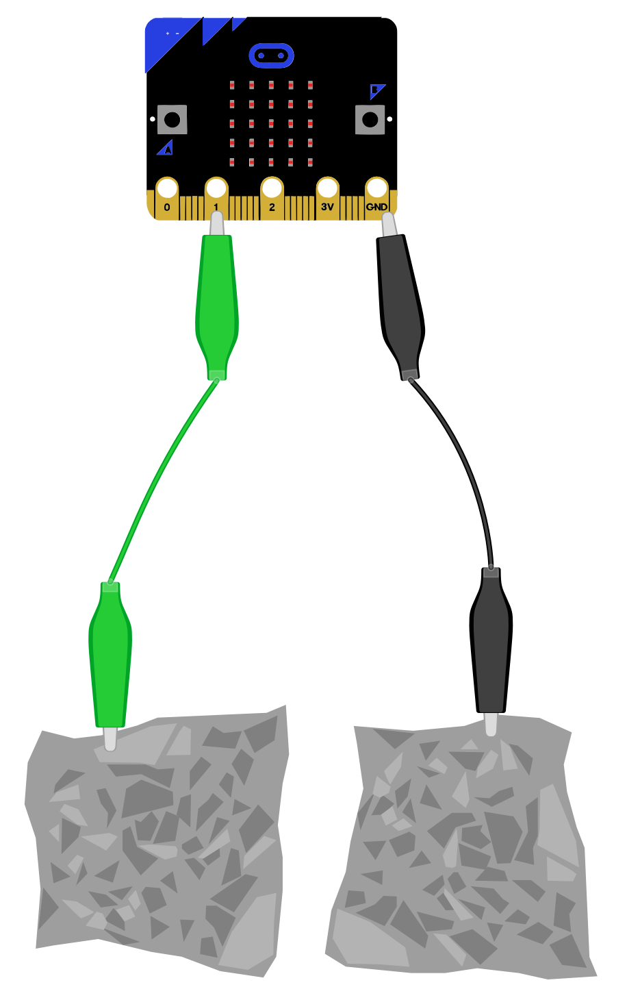

## Foil switch
Get switch working for a basic 

--- task ---

Open the sarter project ADD LINK

--- /task ---

New to micro:bit?
[[[makecode-tour]]]

--- task ---
Attach one of the foil pieces to GND

Attach the other to 1


--- /task ---

```microbit
basic.forever(function () {
    if (input.pinIsPressed(TouchPin.P1)) {
        basic.showIcon(IconNames.SmallSquare)
    }
})

```


```microbit
basic.forever(function () {
    if (!(input.pinIsPressed(TouchPin.P1))) {
        basic.showIcon(IconNames.Square)
    }
    if (input.pinIsPressed(TouchPin.P1)) {
        basic.showIcon(IconNames.SmallSquare)
    }
})

```


```microbit
basic.forever(function () {
    if (!(input.pinIsPressed(TouchPin.P1)) && Mouth_open == false) {
        basic.showIcon(IconNames.Square)
        Mouth_open = true
    }
    if (input.pinIsPressed(TouchPin.P1)) {
        basic.showIcon(IconNames.SmallSquare)
        Mouth_open = false
    }
})
```

```microbit
let Mouth_open = true
```

