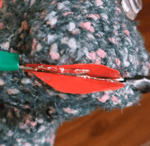
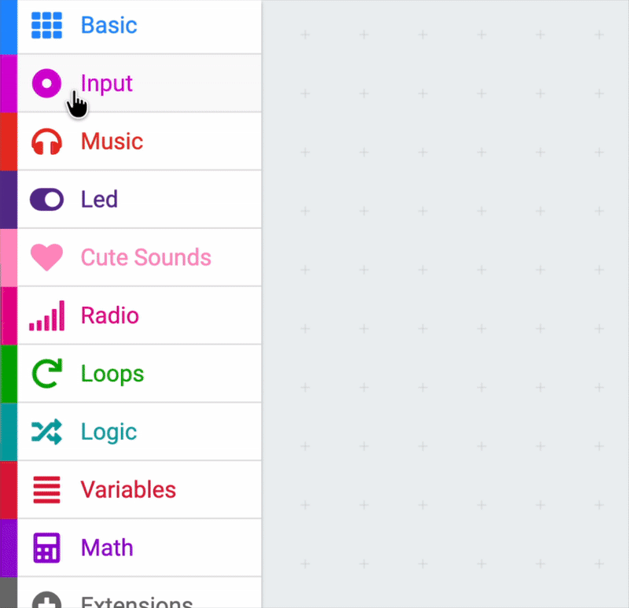

## Foil switch

--- task ---
### Open the project

Open the starter project at [rpf.io/sock-puppet](https://rpf.io/sock-puppet){:target="_blank"}.
--- /task ---


--- task ---
### Make a foil switch

The puppet uses a foil switch to detect if the mouth is **open** or **closed**.



Clip the foil to the Micro:bit to create the switch. One bit of foil is connected to `GND` and the other to `P1`{:class='microbitinput'}. When the foil pieces touch, it completes the circuit.

{:width="500px"}
--- /task ---


--- task ---
### Plug in the board

Connect the micro:bit to your computer with the USB cable. 

Click download, and pair the Micro:bit with your computer.
--- /task ---


--- task ---
### Add the input block

Drag a `pin released`{:class='microbitinput'} block from the `more input`{:class='microbitinput'} menu. 

In the dropdown menu change the pin to `P1`{:class='microbitinput'}.

```microbit
input.onPinReleased(TouchPin.P1, function () {	
})
```
--- /task ---

**Tip:** The `more input`{:class='microbitinput'} menu is hidden, and will appear when you click on input.

{:width="500px"}


--- task ---
Add a `show icon`{:class='microbitbasic'} from the `basic`{:class='microbitbasic'} menu

The icon will show when the foil switch is open.

```microbit
input.onPinReleased(TouchPin.P1, function () {
    basic.showIcon(IconNames.Square)
})
```
--- /task ---


--- task ---
**Test:** connect the two foil bits together and see the icon show when they are released.
--- /task ---