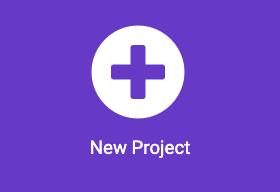
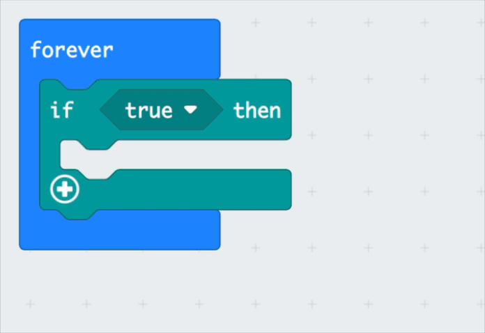
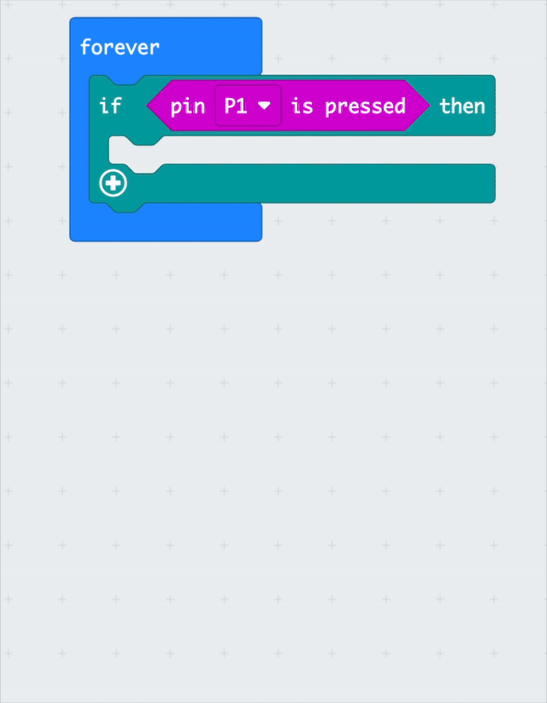

## Foil switch

<div style="display: flex; flex-wrap: wrap">
<div style="flex-basis: 200px; flex-grow: 1; margin-right: 15px;">
Make a foil switch and add to the micro:bit 
</div>
<div>

{:width="300px"}

</div>
</div>

<html>
<div style="position: relative; width: 100%; aspect-ratio: 16 / 9; border-radius: 20px; box-shadow: 0 0 15px #3fb654; overflow: hidden;">
<iframe style="position: absolute; top: 0; left: 0; right: 0; width: 100%; height: 100%; border: none;" src="https://www.youtube.com/embed/t5UzLuTj_CE?rel=0&cc_load_policy=1" allowfullscreen allow="accelerometer; autoplay; clipboard-write; encrypted-media; gyroscope; picture-in-picture; web-share">
</iframe>
</div><br>
</html>
<div style="text-align: center; margin-top: 1em;">

Play, pause, make. Follow the project on our [YouTube](10) playlist!
</div>

###Set up the micro:bit

--- task ---

Open the MakeCode editor at [makecode.microbit.org](https://makecode.microbit.org){:target="_blank"}.

--- /task ---

New to micro:bit?
[[[makecode-tour]]]

--- task ---
### Create your project

Create and name your project: 

Click on the **New Project** button.



--- /task ---

--- task ---

Give your new project a name (e.g. 'Sock puppet') and click **Create**.

--- /task ---


--- task ---
Drag an `if true`{:class='microbitlogic'} block from the `logic`{:class='microbitlogic'}  menu into the `forever`{:class="microbitbasic"} block.

```microbit
basic.forever(function () {
    if (true) {
    	
    }
})
```
--- /task ---

--- task ---
Drag an `Pin is pressed`{:class='microbitinput'} block over `true`{:class='microbitlogic'}, and change to `P1`{:class='microbitinput'} in the dropdown menu.

```microbit
basic.forever(function () {
    if (input.pinIsPressed(TouchPin.P1)) {
        
    }
})
```
--- /task ---

**TIP: line up the red dots


-- task ---
Add a `show icon`{:class="microbitbasic"}, and choose small square from the menu. 

```microbit
basic.forever(function () {
    if (input.pinIsPressed(TouchPin.P1)) {
        basic.showIcon(IconNames.SmallSquare)
    }
})
```
--- /task ---
**TIP: scroll down to choose the small square


### Attach foil switch

--- task ---
On the micro:bit, clip one bit of foil to GND and the other to P1


--- /task ---

--- task ---
Plug your micro:bit into your computer. 

Click download, and click the pair button.
--- /task ---

--- task ---
**Test: Connect the two foil bits together and see the board LEDs light up

--- /task ---
### Make a NOT pressed

```microbit
basic.forever(function () {
    if (!(input.pinIsPressed(TouchPin.P1))) {
        basic.showIcon(IconNames.Square)
    }
    if (input.pinIsPressed(TouchPin.P1)) {
        basic.showIcon(IconNames.SmallSquare)
    }
})

```

```microbit
basic.forever(function () {
    if (!(input.pinIsPressed(TouchPin.P1)) && Mouth_open == false) {
        basic.showIcon(IconNames.Square)
        Mouth_open = true
    }
    if (input.pinIsPressed(TouchPin.P1)) {
        basic.showIcon(IconNames.SmallSquare)
        Mouth_open = false
    }
})
```

```microbit
let Mouth_open = true
```

