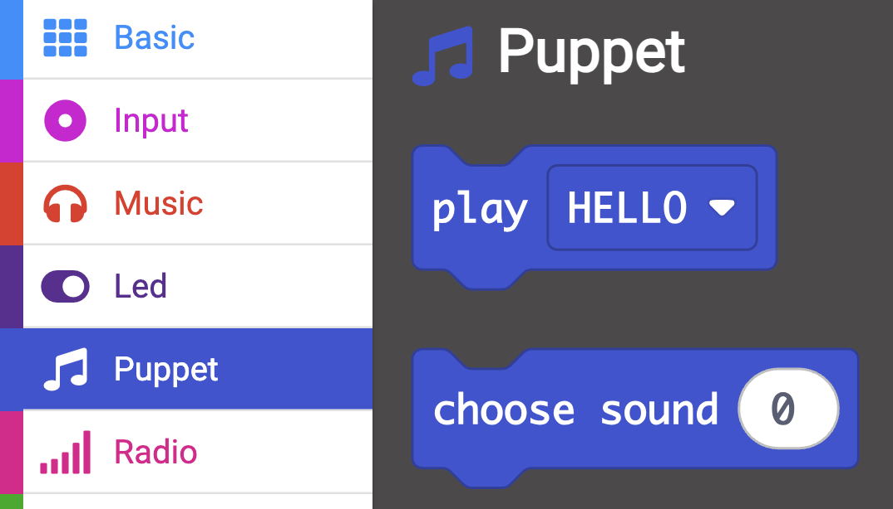
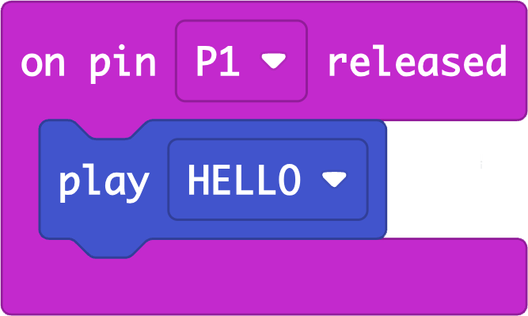

## Add a buzzer

--- task ---
### Add a buzzer to the micro:bit

If you are using a **micro:bit V2** you can skip this step and use the internal buzzer instead.

Clip the short leg to `GND` and the longer leg to `PO`{:class='microbitinput'}.

{:width="500px"}
--- /task ---

We have used a custom **🎵 sound** menu for this project called `Puppet`{:class='microbitfunctions'}! It's full of sounds that you can use for your project.

{:width="500px"}

--- task ---
### Puppet speech
Remove the `show icon`{:class='microbitbasic'} block.

Drag the `play`{:class='microbitfunctions'} block from the `Puppet`{:class='microbitfunctions'} menu into the pin released block. 

{:width="300px"}
--- /task ---

--- task ---
**Test:** Connect the foil swtich by pressing the two foil bits together. Check the buzzer makes a sound when they are released.
--- /task ---

--- task ---
**Experiment:** Change the `Puppet`{:class='microbitfunctions'} sounds in the drop-down menu. Try a few sounds and choose one for your puppet.
--- /task ---