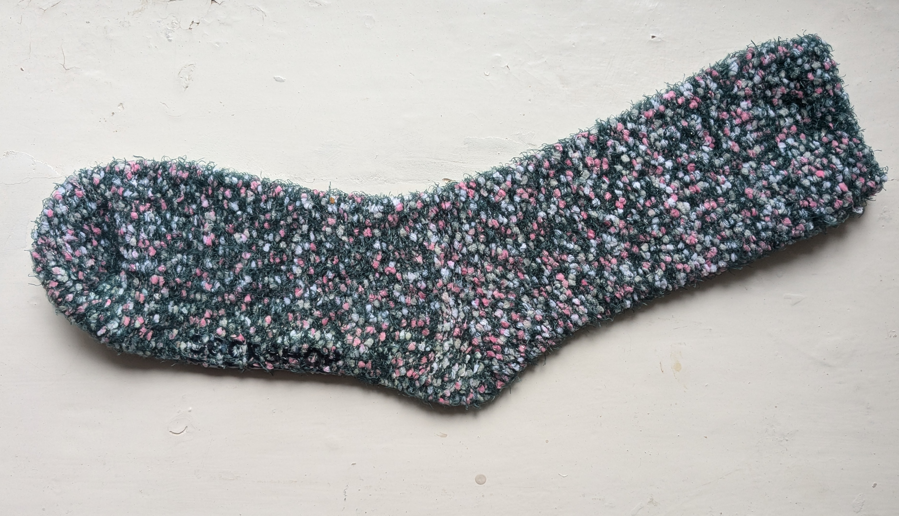
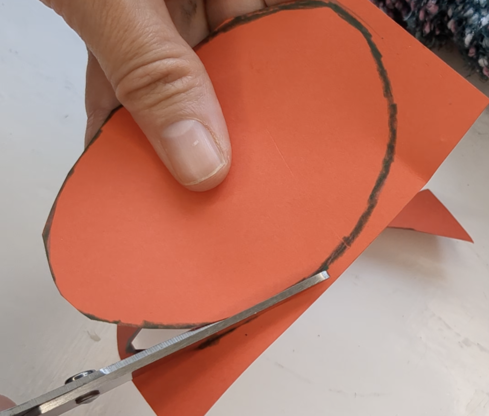
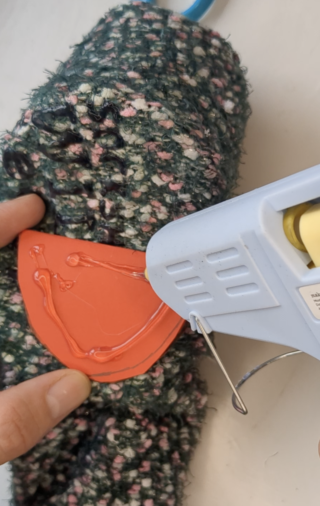
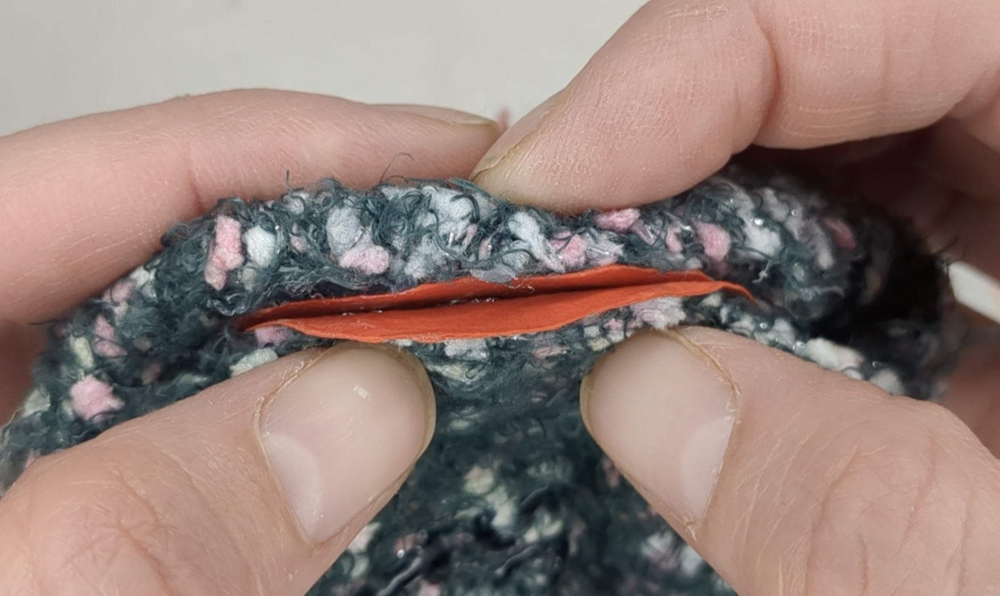
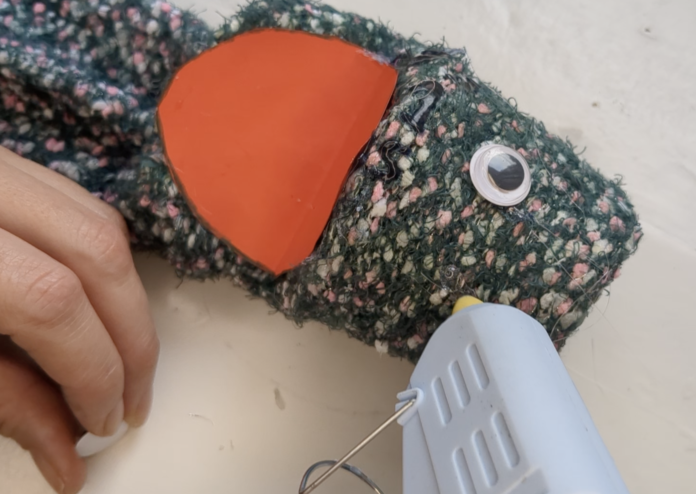
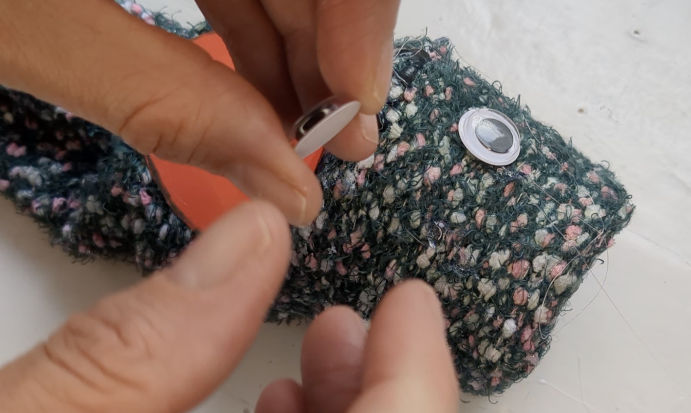

## Make the puppet

--- task ---
### Choose a sock

Choose a sock that will fit on your hand, colourful or textured socks are fun!
{:width="500px"}
--- /task ---

--- task ---
### Add card for a mouth

Cut out thin card to just smaller than the mouth shape.

Tape, sew or glue it on the outside of the sock, where the mouth is.

**Warning:** If you are using hot glue, do not touch the card. Hold the sock on either side instead. 

{:width="500px"}
{:width="500px"}
{:width="500px"}
--- /task ---

--- task ---
### Attach eyes

Glue eyes to the head. 

Googly eyes, buttons, beads, ping-pong balls with black pen all work well.

{:width="500px"}
{:width="500px"}
--- /task ---

