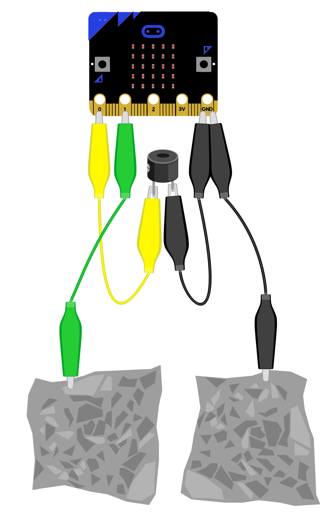
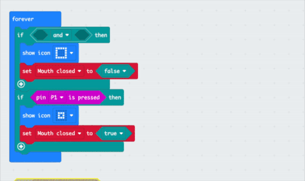

## Add buzzer

<div style="display: flex; flex-wrap: wrap">
<div style="flex-basis: 200px; flex-grow: 1; margin-right: 15px;">
Add buzzer to make some noise!
</div>
<div>

{:width="300px"}

</div>
</div>

<html>
<div style="position: relative; width: 100%; aspect-ratio: 16 / 9; border-radius: 20px; box-shadow: 0 0 15px #3fb654; overflow: hidden;">
<iframe style="position: absolute; top: 0; left: 0; right: 0; width: 100%; height: 100%; border: none;" src="https://www.youtube.com/embed/t5UzLuTj_CE?rel=0&cc_load_policy=1" allowfullscreen allow="accelerometer; autoplay; clipboard-write; encrypted-media; gyroscope; picture-in-picture; web-share">
</iframe>
</div><br>
</html>
<div style="text-align: center; margin-top: 1em;">

Play, pause, make. Follow the project on our [YouTube](10) playlist!
</div>


--- task ---
### Add buzzer to the micro:bit board

If you are using a **micro:bit V2** you can use the internal buzzer, skip this bit and go the blocks below.

Clip the short leg to `GND` and the longer leg to `PO`{:class='microbitinput'}


--- /task ---


--- task ---
### Mouth open blocks

To only play the sound once when the mouth is open, replace the `not`{:class='microbitlogic'} with an `and`{:class='microbitlogic'} block from the `logic`{:class='microbitlogic'} menu.

```microbit
basic.forever(function () {
    if (false && false) {
        basic.showIcon(IconNames.Square)
        Mouth_closed = false
    }
    if (input.pinIsPressed(TouchPin.P1)) {
        basic.showIcon(IconNames.SmallSquare)
        Mouth_closed = true
    }
})
```
--- /task ---

**TIP:** this stops the sound from repeating when the puppet mouth is open.

--- task ---
Drag the `not`{:class='microbitlogic'} and `Pin pressed`{:class='microbitinput'} blocks back into the first field. In the second add an `equals`{:class='microbitlogic'} block.

Add `Mouth closed`{:class='microbitvariables'} and `true'{:class='microbitlogic'} block to this.


--- /task ---


--- task ---
### Puppet speech

Drag two `play tone`{:class='microbitmusic'} blocks.

These will be the happy sounds so change them to 1/2 or 1/4 beat and high notes.

```microbit
basic.forever(function () {
    if (!(input.pinIsPressed(TouchPin.P1)) && Mouth_closed == true) {
        music.play(music.tonePlayable(784, music.beat(BeatFraction.Half)), music.PlaybackMode.UntilDone)
        music.play(music.tonePlayable(698, music.beat(BeatFraction.Quarter)), music.PlaybackMode.UntilDone)
        basic.showIcon(IconNames.Square)
        Mouth_closed = false
    }
    if (input.pinIsPressed(TouchPin.P1)) {
        music.stopAllSounds()
        basic.showIcon(IconNames.SmallSquare)
        Mouth_closed = true
    }
})
```

If using **Micro:bit V2** you could expereiment with the `sound simulator`{:class='microbitmusic'} blocks.
--- /task ---


--- task ---
**Test:** listen for the sounds when the the foil is not pressed together
--- /task ---