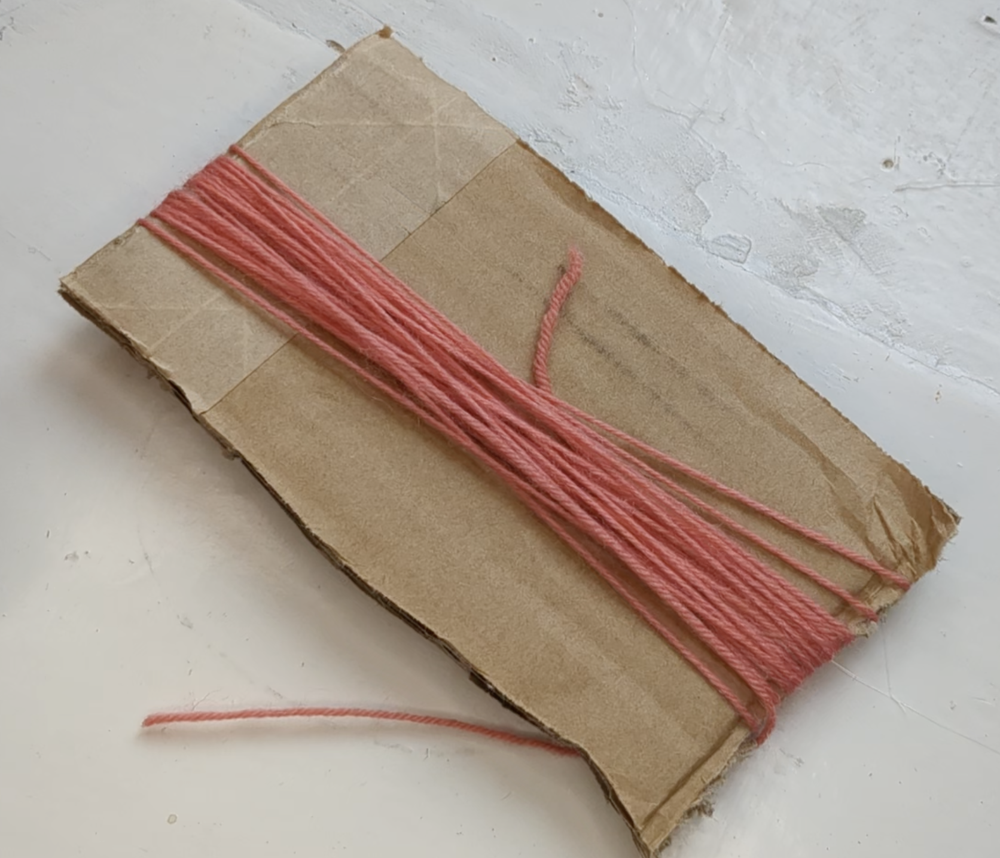
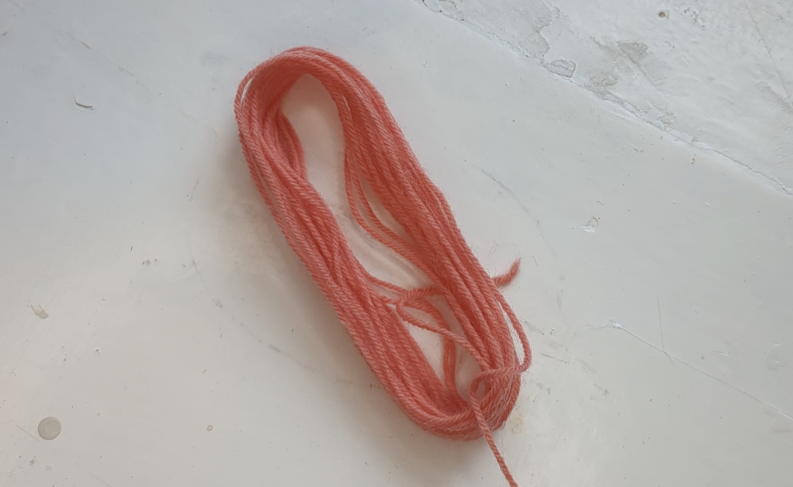
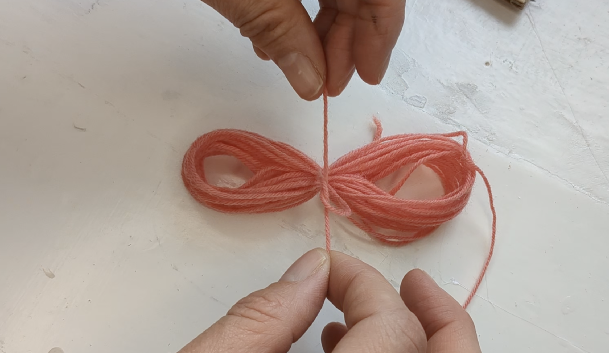
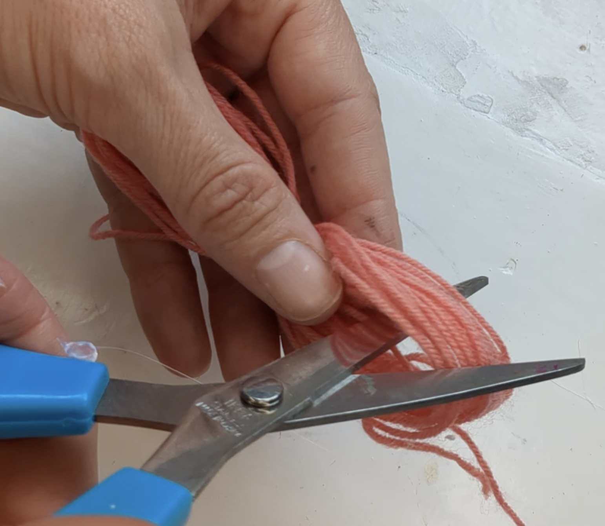
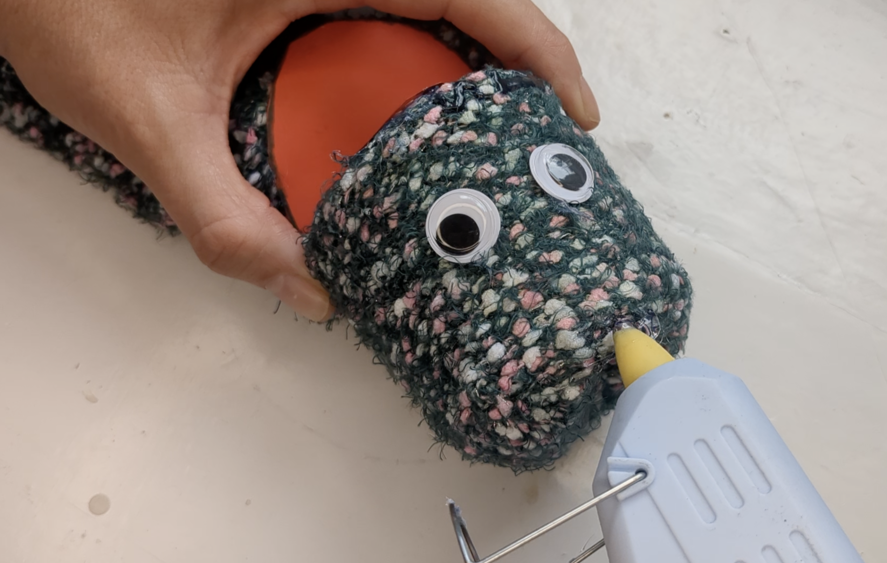
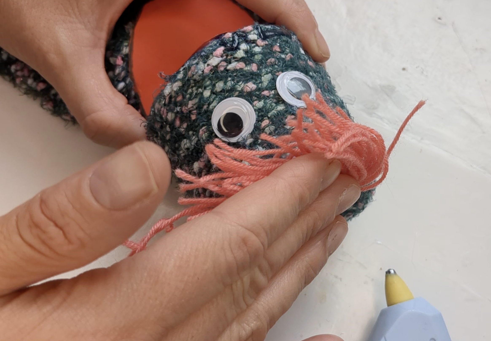
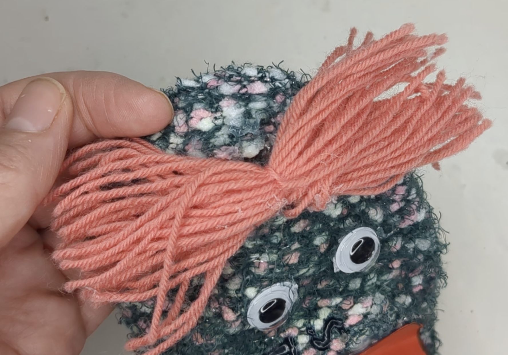
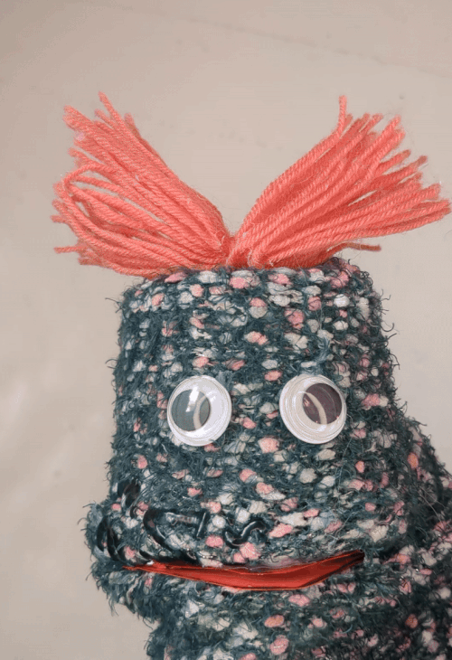

## Hairstyle

Give your puppet a hairdo!

{:width="300px"}

<html>

<iframe style="position: absolute; top: 0; left: 0; right: 0; width: 100%; height: 100%; border: none;" src="https://www.youtube.com/embed/t5UzLuTj_CE?rel=0&cc_load_policy=1" allowfullscreen allow="accelerometer; autoplay; clipboard-write; encrypted-media; gyroscope; picture-in-picture; web-share">
</iframe>

 
</html>

Play, pause, make. Follow the project on our [YouTube](10) playlist!

--- task ---
### Make the hair

Wrap coloured yarn or string around some scrap card. 

{:width="500px"}
--- /task ---

--- task ---
Take yarn off the card and fasten it with another bit of yarn.  

Tie it in a knot in the middle of the yarn to create two loops.

{:width="500px"}
{:width="500px"}
--- /task ---

--- task ---
Cut the end of each loop.

{:width="500px"}
--- /task ---

--- task ---
### Attach and style hair

Sew, tape or glue the yarn in the middle of the head. 

**Warning:** if using hot glue - do not touch the glue directly.

{:width="500px"}
{:width="500px"}
{:width="500px"}
--- /task ---

--- task ---
### Style it

Style the hair how you want it.

--- /task ---