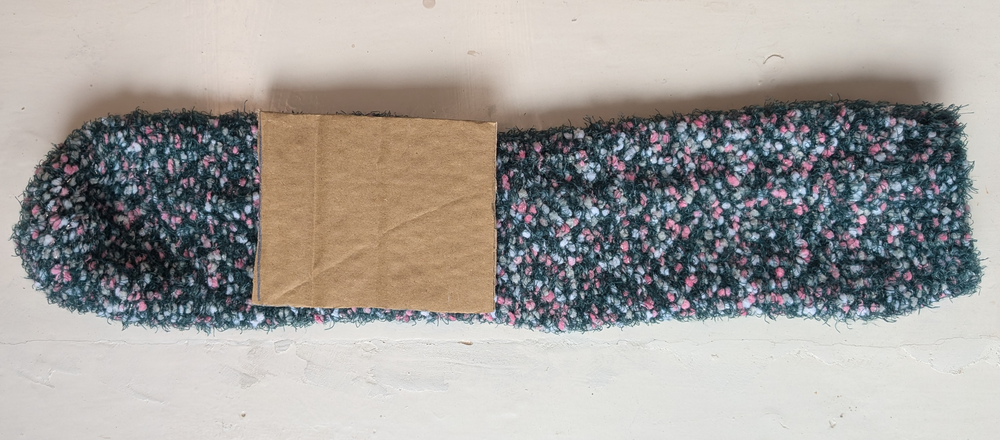
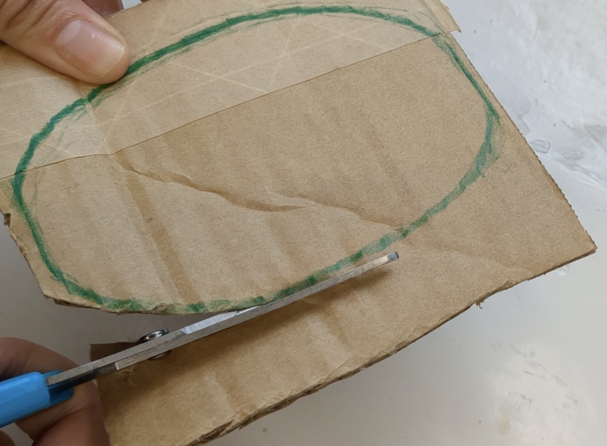
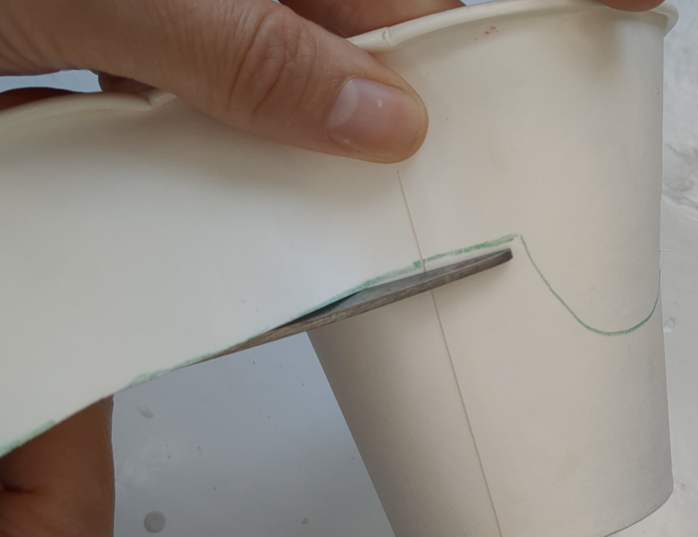
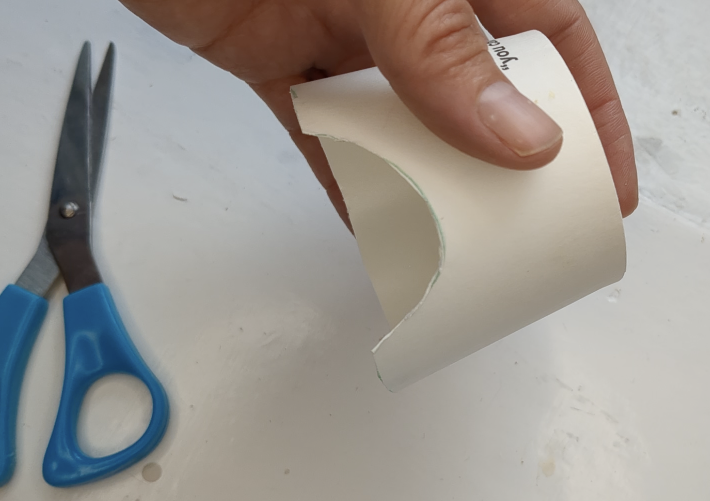
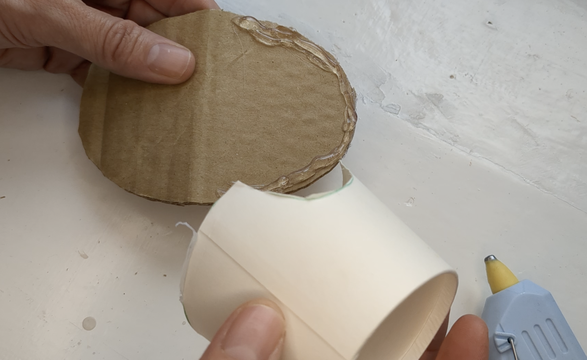
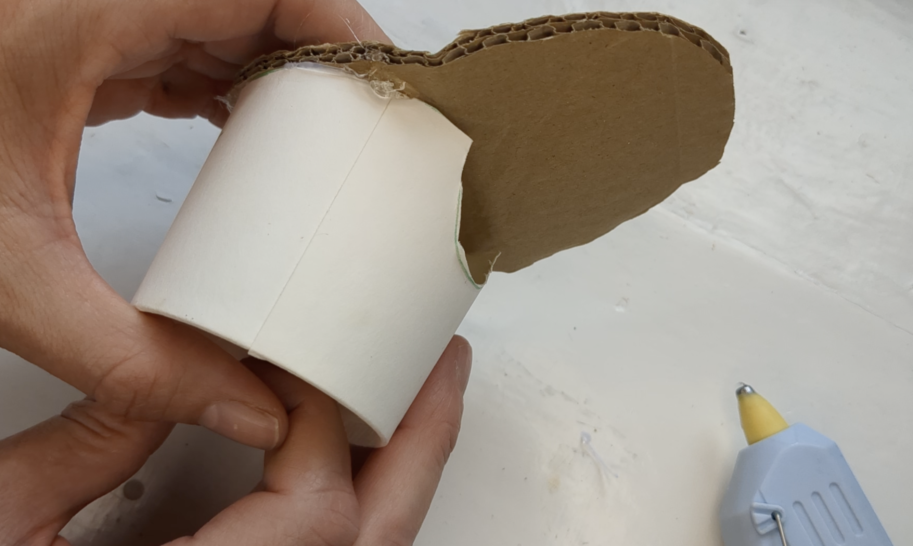
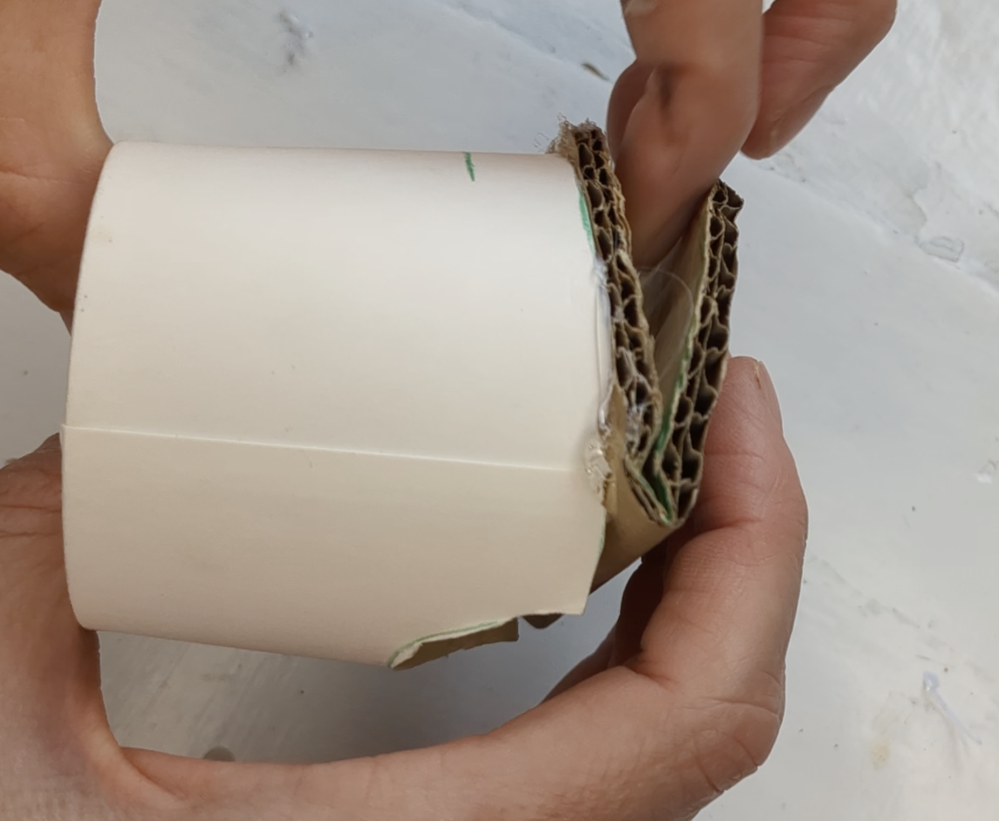
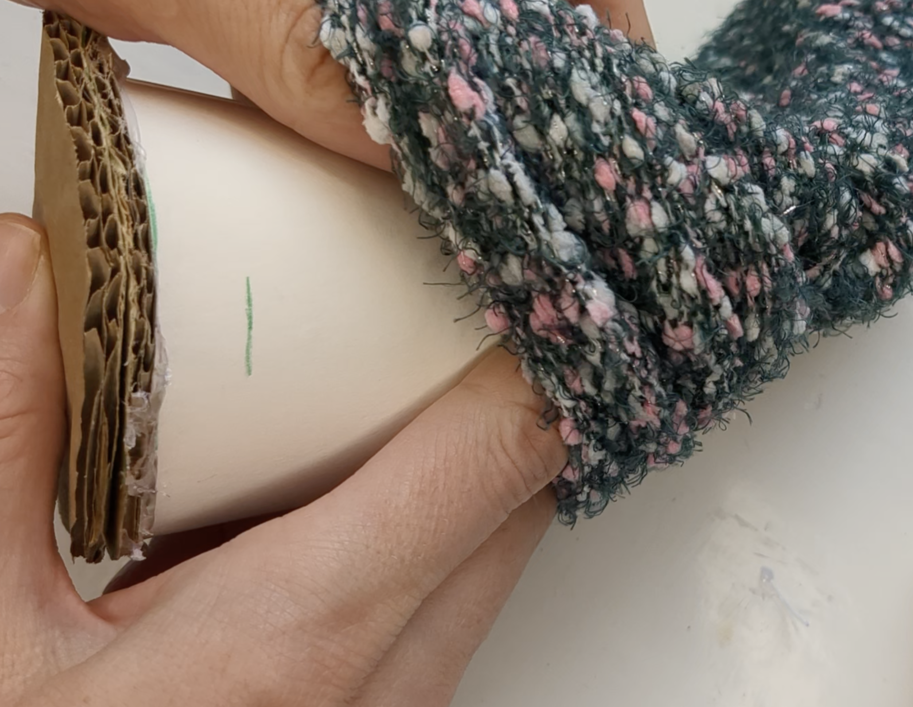
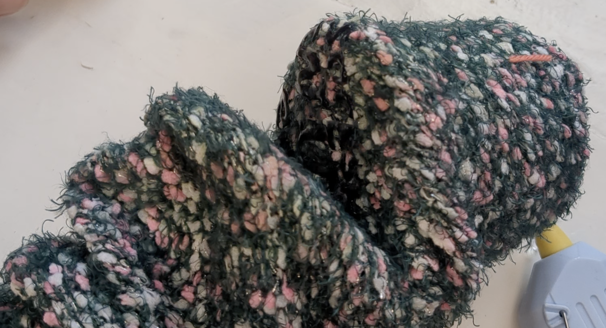

## Make the puppet

Make a foil switch and add to micro:bit 

{:width="300px"}

<html>

<iframe style="position: absolute; top: 0; left: 0; right: 0; width: 100%; height: 100%; border: none;" src="https://www.youtube.com/embed/t5UzLuTj_CE?rel=0&cc_load_policy=1" allowfullscreen allow="accelerometer; autoplay; clipboard-write; encrypted-media; gyroscope; picture-in-picture; web-share">
</iframe>

 
</html>

Play, pause, make. Follow the project on our [YouTube](10) playlist!

--- task ---
### Make the body

Choose a sock that will fit on your arm, colourful or textured socks work well.

--- /task ---

--- task ---
### Cut out card for the mouth

--- /task ---

--- task ---
### Adding a head

Cut out a semi-circle from a papper cup for your fingers.

Glue onto the mouth piece.

--- /task ---

**Tip:** If you are using hot glue make sure that it is supervised by a mentor or club leader

--- task ---
Insert into the end of the sock. 

--- /task ---
