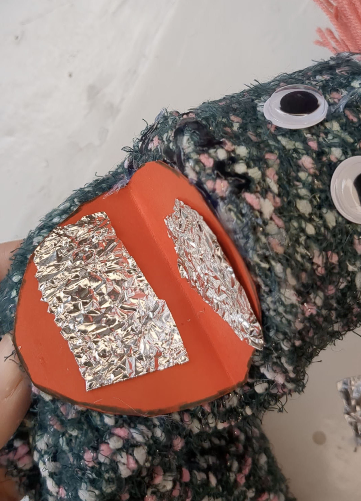
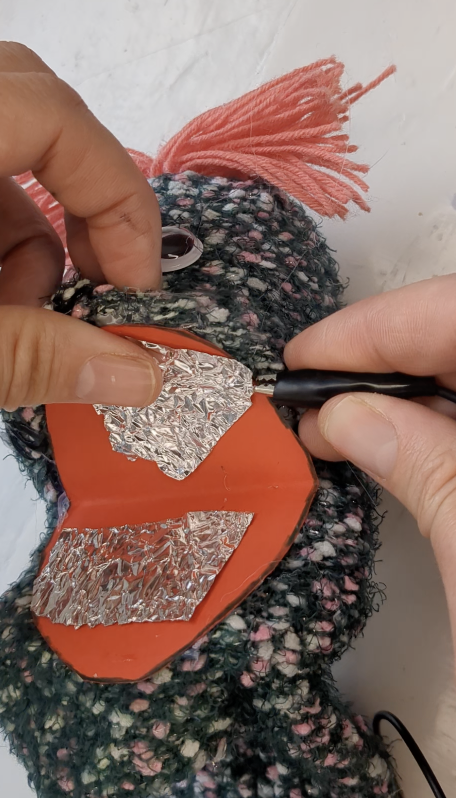
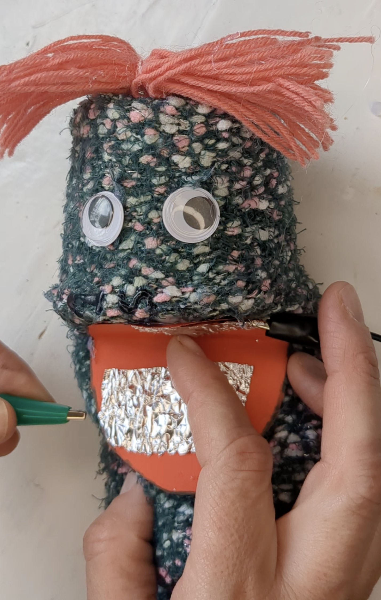
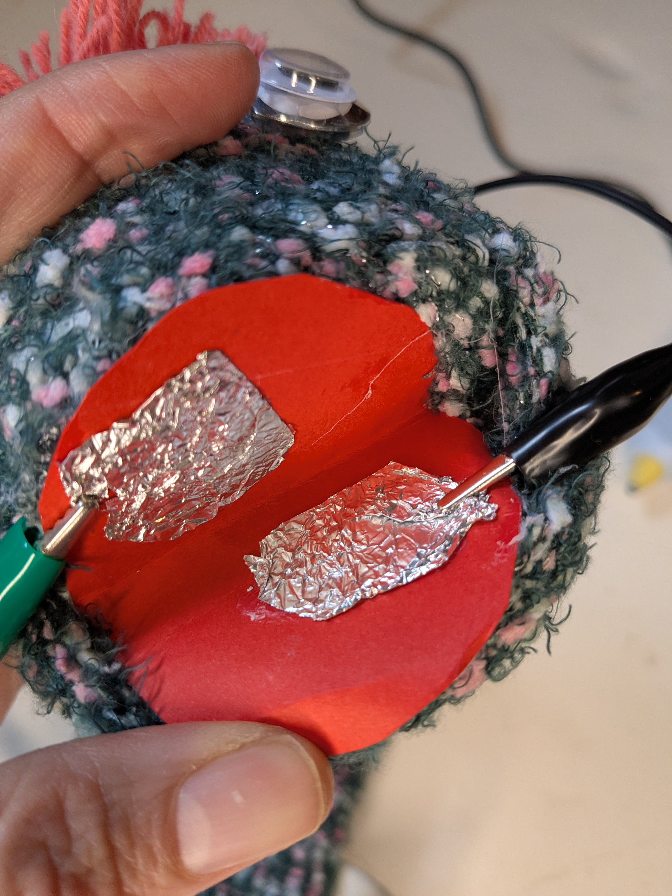

## Embed the switch

Add the foil switch to the mouth.

{:width="300px"}

<html>

<iframe style="position: absolute; top: 0; left: 0; right: 0; width: 100%; height: 100%; border: none;" src="https://www.youtube.com/embed/t5UzLuTj_CE?rel=0&cc_load_policy=1" allowfullscreen allow="accelerometer; autoplay; clipboard-write; encrypted-media; gyroscope; picture-in-picture; web-share">
</iframe>

 
</html>

Play, pause, make. Follow the project on our [YouTube](10) playlist!

--- task ---
### Attach the foil

Glue the foils onto the mouth.

--- /task ---

--- task ---
### Clip it

Clip onto both sides of the foil. One with the `GND` clip and the other with the `pin pressed`{:class='microbitinput'} clip

--- /task ---

