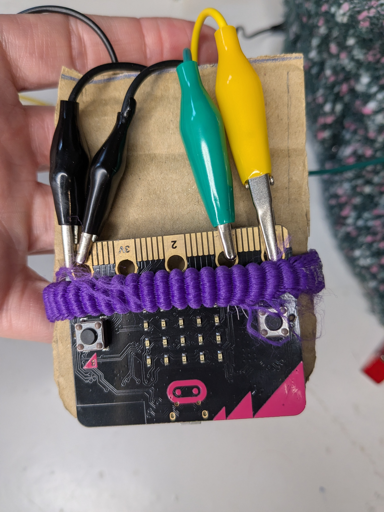
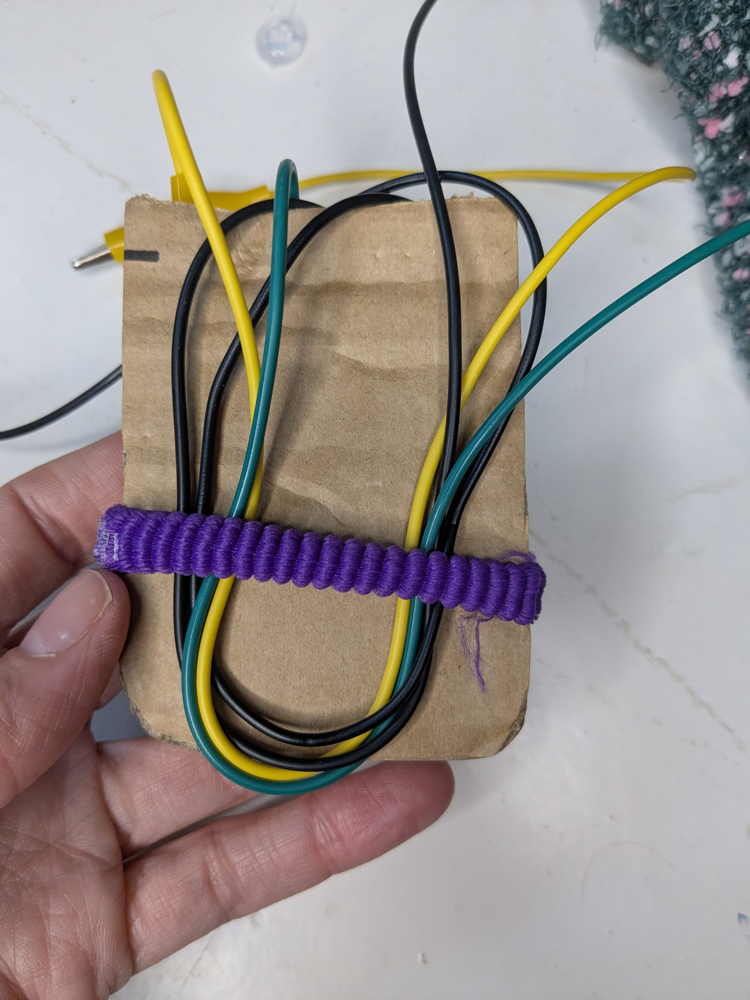
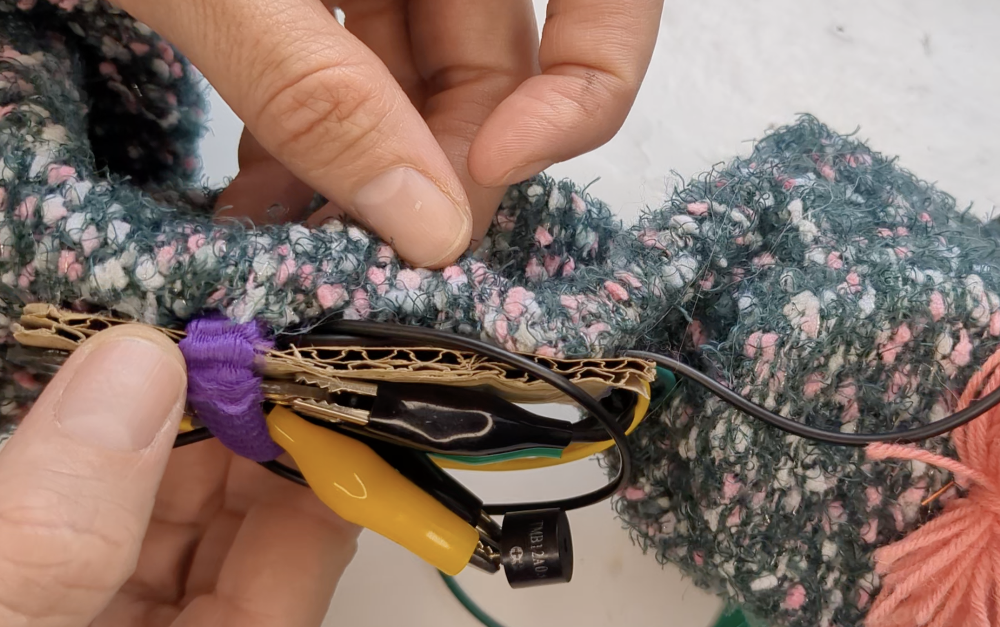
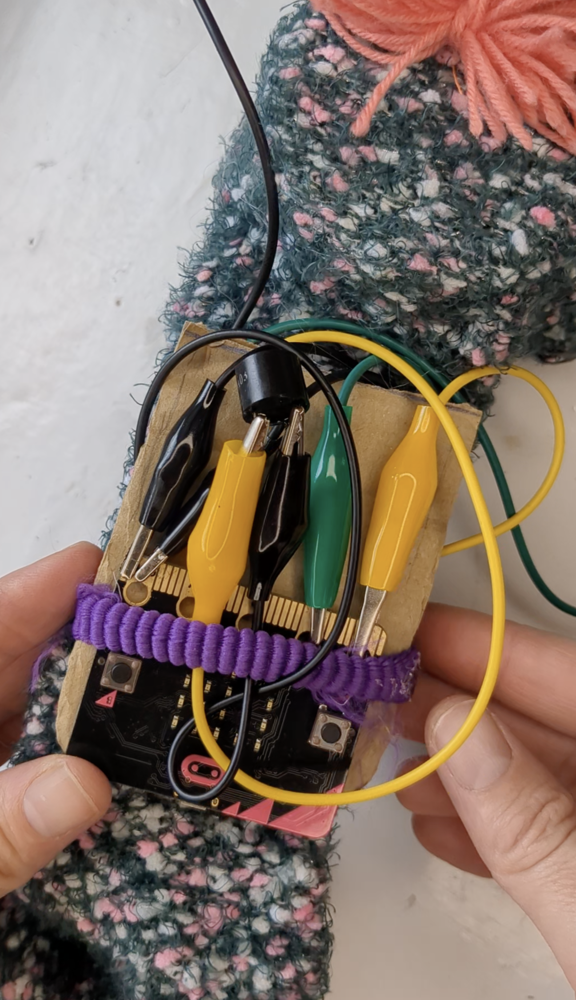

## Attach the micro:bit 

--- task ---
### Use card for the board

Attach the micro:bit board to a bit of cardboard with an elastic or hairband.

{:width="500px"}
--- /task ---

--- task ---
### Organise the wires

Tuck some of the wires under the band on the other side of the card to keep them tidy.

{:width="500px"}
--- /task ---

--- task ---
### Attach to sock

Glue, sew, or tape the card to the sock.

{:width="500px"}
{:width="500px"}
--- /task ---

**Test:** Your puppet is now ready to go! Try it out to see if the sounds play when the mouth opens. You can also change the sound blocks to create different characters.