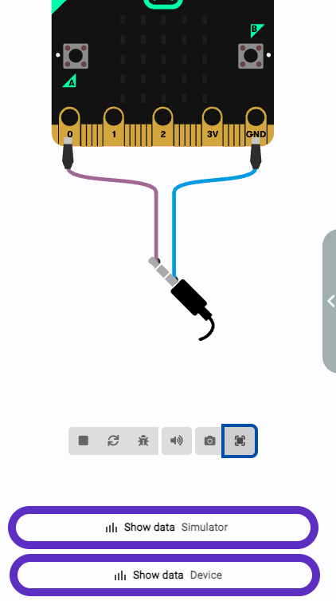
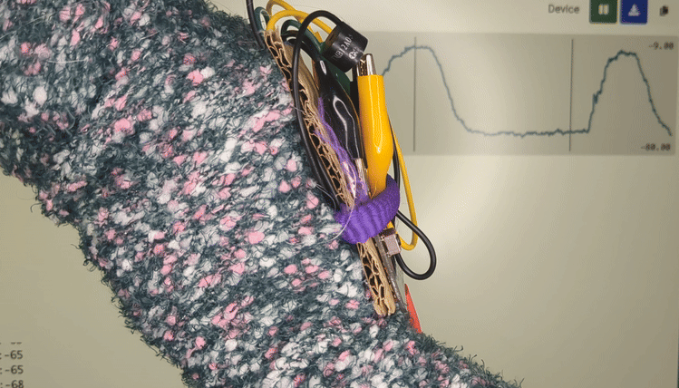
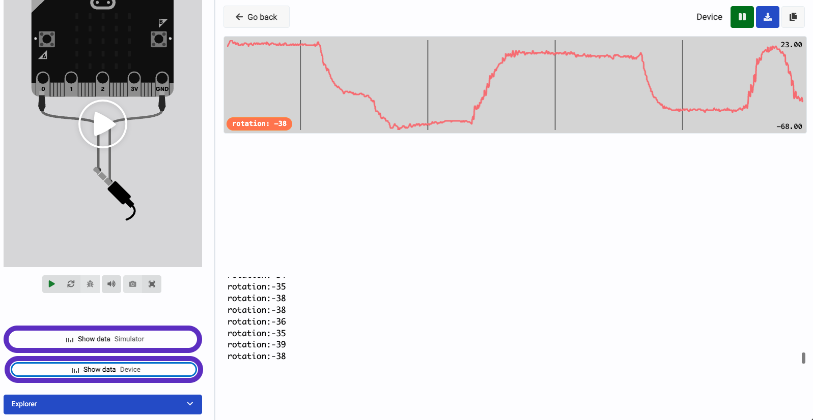

## Rotate 


add cable (need to make image) also is the final image of the whole thing togheter

--- task ---

look at accelerometer data in the serial port
--- /task ---

```microbit
basic.forever(function () {
    serial.writeValue("rotation", input.rotation(Rotation.Pitch))
})
```

Go to device view


look at how the graph moves when you move your arms


record the number when down (in this case it is -38)


