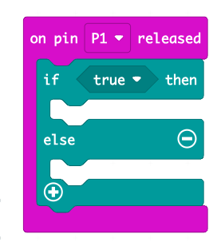
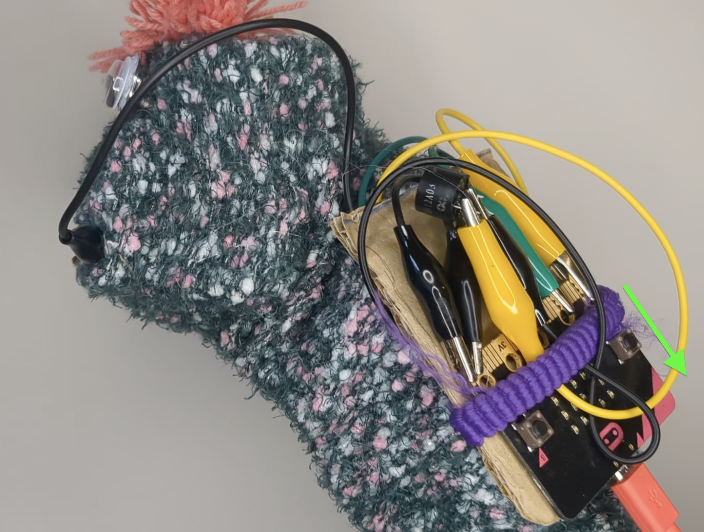
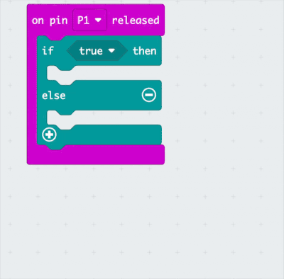
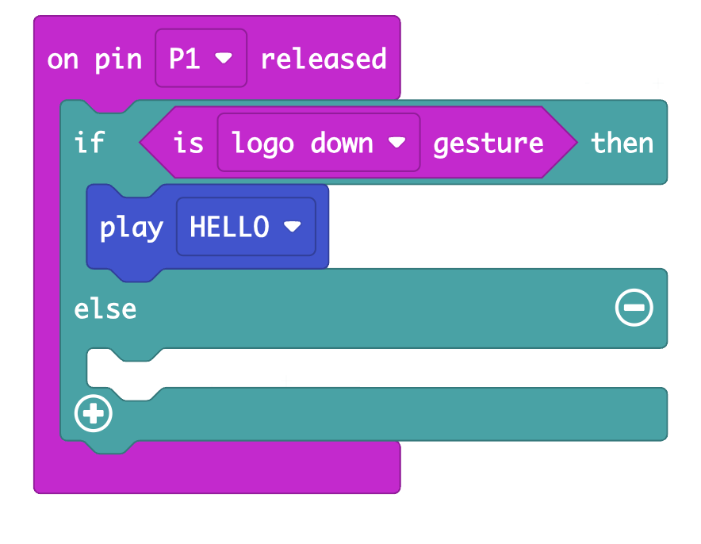
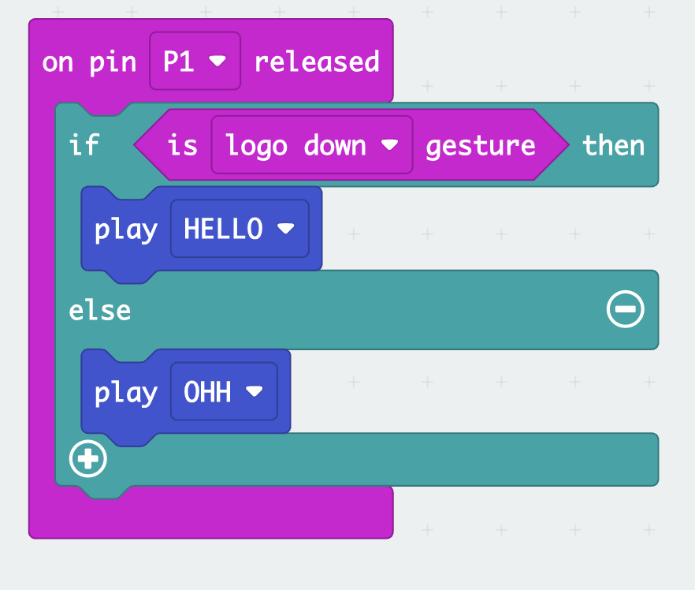

## Challenge! Sound and gestures

Give your puppet more character when it moves.

{:width="300px"}

<html>

<iframe style="position: absolute; top: 0; left: 0; right: 0; width: 100%; height: 100%; border: none;" src="https://www.youtube.com/embed/t5UzLuTj_CE?rel=0&cc_load_policy=1" allowfullscreen allow="accelerometer; autoplay; clipboard-write; encrypted-media; gyroscope; picture-in-picture; web-share">
</iframe>

 
</html>

Play, pause, make. Follow the project on our [YouTube](10) playlist!

--- task ---
### Add a gesture

Remove the `Play`{:class='microbitfunctions'} block and add an `if else`{:class='microbitlogic'} block from the `logic`{:class='microbitinput'} menu. 

{:width="400px"}
--- /task ---

--- task ---
👀 Look at which way up your Micro:bit is on the puppet. If the Microbit is facing down, you can use the `logo down gesture`{:class='microbitinput'} block to trigger the sound in the next step.

**Tip:** if the Micro:bit is a differnt way up, experiment with some of the other gestures.

{:width="500px"}
--- /task ---

--- task ---
Drag the `logo shake gesture`{:class='microbitinput'} block next to the `if` {:class='microbitlogic'}. 

Choose `logo down`{:class='microbitinput'} from the dropdown menu, or a different gesture that works for your puppet. 

{:width="400px"}

--- /task ---

--- task ---
Add the `play HELLO`{:class='microbitfunctions'} block into the top of the `if`{:class='microbitlogic'} block. 

This will play the "hello" sound when the puppet is up.

{:width="400px"}

--- /task ---

--- task ---
Add a new `play`{:class='microbitfunctions'} block from the Puppet{:class='microbitfunctions'} menu into the `else`{:class='microbitlogic'} part of the block, and choose the `ohh`{:class='microbitfunctions'} sound.

This will make a sad sound when the puppet is down.

{:width="400px"}

--- /task ---

--- task ---
**Test:** check the sad and happy sounds are working when you rotate the puppet and open the mouth.
--- /task ---

